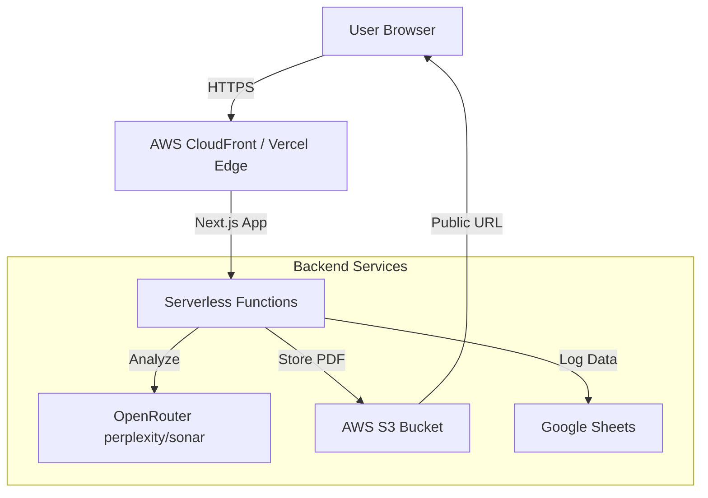

# Dvivid Consultant - Technical Documentation

## Executive Summary
Dvivid Consultant is a specialized web platform designed to assess and guide students in their study abroad journey. The system provides a comprehensive psychometric assessment, analyzes student readiness using AI, and generates detailed, personalized PDF reports. It serves as a bridge between student aspirations and actionable study abroad plans, streamlining the consultancy process through automation and data-driven insights.

## Platform Overview
The platform operates as a modern web application where students complete a multi-factor assessment. The system then processes these responses to evaluate readiness across six key dimensions: Financial Planning, Academic Readiness, Career Alignment, Personal & Cultural Readiness, Practical Readiness, and Support System.

**Key Features:**
*   **Interactive Assessment:** A user-friendly interface for collecting student data and psychometric responses.
*   **AI-Powered Analysis:** Utilizes OpenRouter (model `perplexity/sonar`) to generate deep insights, identifying strengths, gaps, and country fit.
*   **Automated PDF Generation:** Dynamically creates professional-grade PDF reports with charts and personalized recommendations.
*   **Cloud Storage & Management:** Automatically stores reports in AWS S3 and logs student data in Google Sheets for admin management.
*   **Seamless Delivery:** Provides instant access to reports for students and consultants.

## Technology Stack

### Frontend
*   **Framework:** Next.js 14 (App Router)
*   **Language:** TypeScript
*   **Styling:** Tailwind CSS, Tailwind Merge, CLSX
*   **UI Components:** Radix UI (Primitives), Headless UI, Lucide React (Icons)
*   **Animations:** Framer Motion
*   **Forms:** React Hook Form, Zod (Validation)
*   **Visualization:** Recharts (Charts), Custom SVG implementations

### Backend
*   **Runtime:** Node.js (via Next.js API Routes)
*   **AI Engine:** OpenRouter (model `perplexity/sonar`) via the official `@openrouter/sdk` client
*   **PDF Engine:** Puppeteer (Local), Puppeteer Core + @sparticuz/chromium (Serverless/Vercel)
*   **Storage:** AWS S3 (Report storage)
*   **Database/CMS:** Google Sheets API (Data logging and lead management)
*   **Authentication:** Clerk

### Infrastructure & DevOps
*   **Hosting:** AWS Amplify / Vercel
*   **Package Manager:** pnpm
*   **Version Control:** Git

## System Architecture

### High-Level Architecture
The system follows a serverless architecture pattern. The client (Next.js) handles user interaction and state. API routes act as the backend controller, orchestrating calls to external services (Perplexity, Google Sheets, AWS S3) and handling compute-intensive tasks like PDF generation.

### Component-Level Architecture
1.  **Client Layer:**
    *   **Marketing Pages:** Landing pages explaining the service.
    *   **Assessment Flow:** Multi-step form wizard collecting user inputs.
    *   **Results View:** Displays a summary of the analysis to the user.

2.  **API Layer (`src/app/api`):**
    *   `/analyze-results`: Receives raw assessment data, constructs prompts, and queries OpenRouter (`perplexity/sonar`) to interpret the results.
    *   `/generate-pdf`: Receives the analyzed data, renders an HTML template, converts it to PDF using Puppeteer, uploads to S3, and updates Google Sheets.

3.  **Service Layer:**
    *   **OpenRouter (`perplexity/sonar`):** Acts as the reasoning engine to determine "Readiness Level" and "Country Fit".
    *   **Google Sheets:** Acts as the primary database for lead tracking and report URLs.
    *   **AWS S3:** Durable object storage for generated PDF files.

### Data Flow
1.  **User Input:** Student completes the assessment on the frontend.
2.  **Submission:** Data is sent to `/api/analyze-results`.
3.  **Analysis:** Backend sends prompts to OpenRouter (`perplexity/sonar`) -> Returns JSON analysis (Scores, Strengths, Gaps, Recommendations).
4.  **Generation:** Frontend (or chained backend call) sends analysis to `/api/generate-pdf`.
5.  **Rendering:** Backend generates HTML with dynamic charts (Radar, Circular Progress).
6.  **PDF Creation:** Puppeteer renders HTML to PDF buffer.
7.  **Storage:** PDF uploaded to AWS S3 -> Returns public URL.
8.  **Logging:** Student details and PDF URL appended to Google Sheet.
9.  **Delivery:** PDF URL returned to client for download/display.

### Security Model
*   **Environment Variables:** Sensitive keys (API keys, Credentials) are stored in server-side environment variables, never exposed to the client.
*   **Authentication:** Clerk handles user authentication (if enabled for specific routes).
*   **Least Privilege:** Google Service Account has scoped access only to specific spreadsheets. AWS IAM users should be restricted to S3 bucket operations.

## Deployment Architecture

### Hosting Provider
The application is configured for deployment on **AWS Amplify** (primary) or **Vercel**.
*   **Amplify Config:** Defined in `amplify.yml`. Handles build phases (preBuild, build) and artifact management.
*   **Vercel Config:** Defined in `vercel.json`. Optimized for serverless functions with increased memory/timeout limits for PDF generation.

### Infrastructure Diagram


### CI/CD Pipeline
*   **Trigger:** Push to `main` branch.
*   **Build:** `pnpm install` -> `pnpm build`.
*   **Environment:** Secrets injected during build time via platform dashboard (Amplify Console / Vercel Dashboard).
*   **Artifacts:** `.next` folder deployed to edge locations/lambda.

## Functional Documentation

### Core Modules
1.  **Assessment Engine:**
    *   Located in `src/app/(main)`.
    *   Manages state for multi-step questions.
    *   Validates inputs using Zod schemas.

2.  **PDF Generator (`/api/generate-pdf`):**
    *   **Input:** JSON object containing student details and analysis.
    *   **Process:**
        *   Validates data.
        *   Launches Headless Chrome (optimized for serverless).
        *   Injects data into an HTML template with inline CSS.
        *   Generates charts using SVG generation functions (no external charting lib dependency for server-side rendering).
        *   Outputs PDF buffer.
    *   **Output:** PDF Buffer (download) or S3 URL.

3.  **Analysis Engine (`/api/analyze-results`):**
    *   **Input:** Raw quiz answers.
    *   **Logic:**
        *   Calculates raw scores per category.
        *   Constructs a complex prompt for OpenRouter (`perplexity/sonar`).
        *   Enforces JSON output format from the AI.
    *   **Output:** Structured JSON with qualitative and quantitative insights.

## Backend Logic

### API Routes
*   **`POST /api/analyze-results`**:
    *   **Logic:** Aggregates scores -> Calls AI -> Parses JSON.
    *   **Key Detail:** Uses a fallback mechanism for AI models (`sonar-pro`, `sonar`) to ensure reliability.
    *   **Timeout:** Handles long-running AI requests (up to 60s).

*   **`POST /api/generate-pdf`**:
    *   **Logic:** HTML Template -> Puppeteer -> PDF -> S3 -> Sheets.
    *   **Key Detail:** Differentiates between local dev (full Puppeteer) and production (Puppeteer Core + Chromium) to fit within serverless size limits.
    *   **Google Sheets:** Appends a new row or updates an existing one based on email match.

### Integrations
*   **Google Sheets:** Used as a lightweight CRM.
    *   **Sheet ID:** Configured in code/env.
    *   **Columns:** Email, Phone, Survey Type, Timestamp, Lead Generated, Contacted, S3 URL.
*   **AWS S3:**
    *   **Bucket:** `dvividpdfreport` (or from env `S3_BUCKET`).
    *   **Key Format:** `reports/{student-name}-{timestamp}.pdf`.

## Database Schema (Google Sheets)
The system uses a flat-file structure in Google Sheets.

| Column Index | Header | Description |
| :--- | :--- | :--- |
| A | Email | Unique identifier for the student |
| B | Phone | Contact number |
| C | Survey Type | Type of assessment taken |
| D | Timestamp | ISO date string of submission |
| E | Lead Generated | (Operational flag) |
| F | Contacted | (Operational flag) |
| G | S3 URL | Direct link to the generated PDF report |

## Admin/Operational Instructions

### How to Update Site Content
*   **Text/Images:** Most content is hardcoded in React components (`src/components`). Update the code and redeploy.
*   **Assessment Questions:** Modify the data files in `src/constants` or `src/app/(main)` (depending on implementation).

### How to Maintain the System
*   **Monitoring:** Check Vercel/Amplify logs for API failures (500 errors).
*   **Google Sheets:** Ensure the Service Account email has "Editor" access to the Google Sheet.
*   **S3:** periodically check bucket size and lifecycle policies (if any).

### Common Failure Points & Fixes
1.  **PDF Generation Timeout:**
    *   *Cause:* Serverless function took too long (>10s or >60s).
    *   *Fix:* Increase timeout in `vercel.json` or optimize HTML complexity.
2.  **Google Sheets Error:**
    *   *Cause:* Service Account permissions revoked or Sheet ID changed.
    *   *Fix:* Re-share sheet with service account email.
3.  **AI API Failure:**
    *   *Cause:* OpenRouter API key expired or out of credits.
    *   *Fix:* Rotate `OPENROUTER_API_KEY` in environment variables.

## Infrastructure Details
*   **Region:** `ap-south-1` (AWS Mumbai) preferred for S3.
*   **Resource Allocation:**
    *   **Memory:** 1024MB+ recommended for PDF generation functions.
    *   **Timeout:** Set to 60s for `/api/generate-pdf`.

## Setup Guide

### Local Development Setup
1.  **Prerequisites:** Node.js 20+, pnpm.
2.  **Clone Repository:** `git clone <repo-url>`
3.  **Install Dependencies:**
    ```bash
    pnpm install
    ```
4.  **Environment Variables:** Create `.env.local` with:
    ```env
    GOOGLE_SERVICE_ACCOUNT_KEY={...}
    GOOGLE_SHEET_ID=...
    OPENROUTER_API_KEY=...
    S3_BUCKET=...
    APP_REGION=...
    AWS_ACCESS_KEY_ID=... (for local S3 upload)
    AWS_SECRET_ACCESS_KEY=...
    ```
5.  **Run Development Server:**
    ```bash
    pnpm dev
    ```

### Build and Run
*   **Build:** `pnpm build`
*   **Start Production:** `pnpm start`

## Maintenance Guide

### Update Procedure
1.  Pull latest changes: `git pull origin main`
2.  Update dependencies: `pnpm update`
3.  Test locally: `pnpm dev`
4.  Push to deploy: `git push origin main`

### Security Patch Process
*   Regularly run `pnpm audit` to check for vulnerabilities.
*   Update `puppeteer` and `@sparticuz/chromium` in sync to ensure compatibility.

## Future Improvements

### Scalability Considerations
*   **Queue System:** Move PDF generation to a background queue (AWS SQS + Lambda) to avoid HTTP timeouts and improve user experience.
*   **Database Migration:** Move from Google Sheets to a proper SQL database (PostgreSQL) as lead volume grows.

### UX Improvements
*   **Progressive Loading:** Show "Analyzing..." -> "Generating PDF..." steps clearly to the user.
*   **Email Delivery:** Integrate SendGrid/AWS SES to email the PDF directly instead of just providing a download link.

### Technical Debt
*   **Hardcoded IDs:** Move Sheet IDs and specific logic out of `route.ts` into a config file.
*   **Type Safety:** Improve TypeScript interfaces for the AI response to be more strict.
